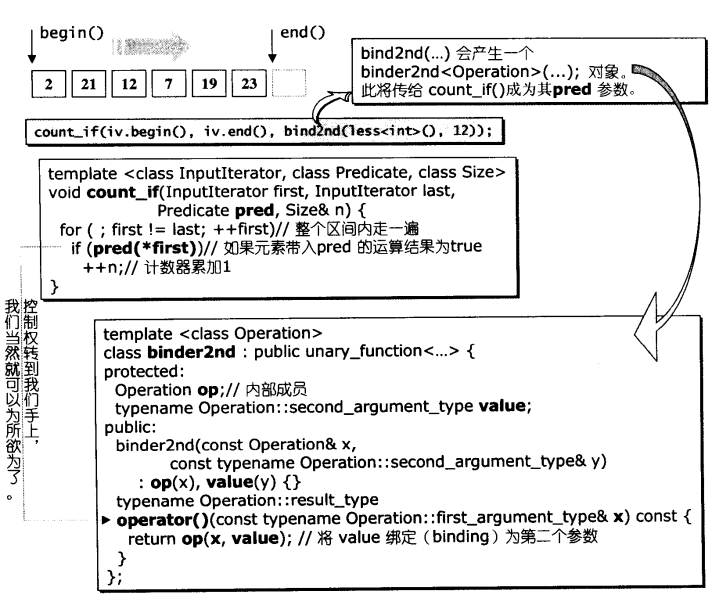

# 配接器

```txt
代码简述:
  01-iterator_adapters_test.cpp:迭代器适配器示例
  02-insert_iterator.cpp:迭代器适配器之插入
  03-reverse_iterator.cpp:逆转迭代器适配器
  04-iostream_iterator.cpp:IO迭代器适配器
  05-negate.cpp:对返回值进行逻辑否定
  06-binder.cpp:对参数进行绑定
  07-compose.cpp:函数合成
  08-ptr_fun.cpp:函数指针
  09-mem_fun_test.cpp:成员函数指针示例
  10-mem_fun.cpp:成员函数指针
```

## 1. 概述

- 配接器分类
  - 应用于容器:container adapters
  - 应用于迭代器:itertor adapters
    - 使用时需引入< iterator >
  - 应用于仿函数:functor adapters
    - 配接器中最多的一批，应用非常灵活
    - 需要引入< functional >
    - 它的价值在于，通过它们之间的绑定、组合、修饰能力，可以无限制的创造出各种表达式
    - 所有期望获得配接能力的组件，本身必须是可配接的

## 2. container adapters

- stack
  - 底层由deque构成，封住了deque的对外接口，只开放几个符合stack原则的函数
- queue
  - 类似于stack

## 3. iterator adapters

### 3.1. insert iterators

- 将一般迭代器的赋值操作转变为插入操作
  - 迭代器就包括了专门用来尾端插入操作的back_insert_iterator
  - 专门用来头端插入的front_insert_iterator
  - 从任何位置插入的insert_iterator
- 但是这三个接口不太好用，不够直观，就给他们三个辅助函数

|辅助函数|实际产生的对象|
|--|--|
|Back_inserter(Container& x);|back_insert_iterator< Container >(x);|
|front_inserter(Container& x);|front_insert_iterator< Container >(x);|
|Inserter(Container& x, Iterator i);|insert_iterator< Container >(x, Container::iterator(i));|

- 每一个insert iterators的内部维护一个容器(用户指定)
  - 客户端对insert iterators做赋值操作时，就在insert iterators中被转为对该容器的迭代器做插入操作

### 3.2. reverse iterators

- 将一般迭代器的行进方向逆转
  - 就是将operator++(--)操作变为operator--(++)操作
- 这样操作能够很方便"从尾端开始进行"的算法
- 就是当STL算法接受的不是正常的迭代器，而是逆向迭代器，就有它的用武之地了


- 双向序列容器都提供了begin(),end()以及rbegin(),rend()
  - 但是因为前闭后开的原则，正向迭代器和它对应的逆向迭代器真正指向的不是同一个元素
  - 也只有这样才能让我们在将一个正向迭代器区间转换为一个逆向迭代器区间之后不必额外的处理，就可以让接受这个逆向迭代器区间的算法以相反的元素次序来处理区间中的每一个元素

### 3.3. IOstream iterators

- 将迭代器绑定到某个iostream对象身上
  - 绑定到istream对象身上，拥有输入功能，称为istream_iterator
  - 绑定到ostream对象身上，拥有输出功能，称为ostream_iterator

- 它就是在内部维护一个istream member
  - 客户端对这个迭代器做的operator++操作会调用迭代器内部所含的那个istream member的输入操作(operator>>)
- 它就是在内部维护一个ostream member
  - 客户端对这个迭代器做的operator++操作会调用迭代器内部所含的那个istream member的输入操作(operator<<)

**它们很重要：**

它们为我们展示了该如何为自己量身定制一个迭代器，绑定在自己需要的装置上

## 4. functor adapters

- 对返回值进行逻辑否定
- 对参数进行绑定
- 用于函数合成
- 用于函数指针
- 用于成员函数指针

- 它是配接器中数量最多的，非常灵活
  - 它可以一直配接
  - 它的配接操作包括
    - 绑定
    - 否定
    - 组合
    - 对一般函数或成员函数修饰(使它称为一个仿函数)

***所有期望获得配接能力的组件，它本身必须是可配接的***

|辅助函数(helper function)|实际效果|实际产生的对象|
|--|--|--|
|bind1st(const Op& op, const T& x);|op(x, param)|binder1st< Op >(op, arg1_type(x))|
|bind2nd(const Op& op, const T& x);|op(x, param)|binder2nd< Op >(op, arg2_type(x))|
|not1(const Pred& pred);|!pred(param);|unary_negate< Pred >(pred)|
|not2(const Pred& pred);|!pred(param1, param2);|binary_negate< Pred >(pred)|
|compose1(const Op1& op1, const Op2& op2);|op1(op2(param));|unary_compose<Op1, Op2>(op1, op2)|
|compose2(const Op1& op1, const Op2& op2, const Op3& op3);|op1(op2(param), op3(parm));|binary_compose<Op1, Op2, Op3>(op1, op2, op3)|
|ptr_fun(Result(*fp)(Arg));|fp(param);|pointer_to_unary_function<Arg, Result>(fp)|
|ptr_fun(Result(*fp)(Arg1, Arg2));|fp(param1, parm2);|pointer_to_binary_function<Arg1, Arg2, Result>(fp)|
|mem_fun(S(T::*f)());|(param->*f)();|mem_fun_t<S, T>(f)|
|mem_fun(S(T::*f)() const);|(param->*f)();|const_mem_fun_t<S, T>(f)|
|mem_fun_ref(S(T::*f)());|(param.*f)();|mem_fun_ref_t<S, T>(f)|
|mem_fun_ref(S(T::*f)() const);|(param.*f)();|const_mem_fun_ref_t<S, T>(f)|
|mem_fun1(S(T::*f)(A));|(param->*f)();|mem_fun_t<S, T, A>(f)|
|mem_fun1(S(T::*f)(A) const);|(param->*f)();|const_mem_fun_t<S, T, A>(f)|
|mem_fun1_ref(S(T::*f)(A));|(param.*f)();|mem_fun_ref_t<S, T, A>(f)|
|mem_fun1_ref(S(T::*f)(A) const);|(param.*f)();|const_mem_fun_ref_t<S, T, A>(f)|

- 各种function adapters及其辅助函数，以及实际效果

***对于C++ template理解***

- 容器是以class templates完成
- 算法是以function templates完成
- 仿函数是一种将operator()重载的class template
- 迭代器是一种将operator++和operator*等指针常用的行为重载的class template
- 配接器也是一种class template

***以count_if为例，讲解绑定过程***



- bind2nd(less< int>(), 12)
  - bind2nd是将二元函数转换为一元函数
  - 它会通过构造函数产生一个binder2nd< Operation>对象
  - Operation是less
  - 将它作为第三参数给count_if

### 4.1. 四种仿函数配接器

- 对返回值进行逻辑否定:not1,not2
- 对参数进行绑定:bind1st,bind2nd
- 用于函数合成:compose1,compose2
- 用于函数指针:ptr_fun
  - 这种配接器能够使我们将一般函数当作仿函数使用
  - 一般函数传给STL算法，类似原生指针被当作迭代器传给STL算法
- 用于成员函数指针:mem_fun,mem_fun_ret
  - 这种配接器能够使我们将成员函数当作仿函数来使用，成员函数就可以搭配各种泛型算法
  - 当容器的元素类型是X&或X*，我们以虚拟成员函数作为仿函数，就可以由泛型算法完成多态调用
    - 这是多态和泛型之间的重要接轨


- 右侧是类阶层体系，左侧是实例产生的容器状态
